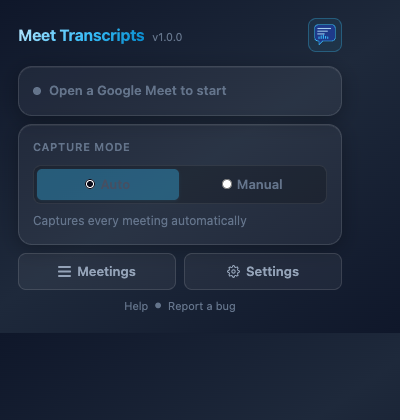
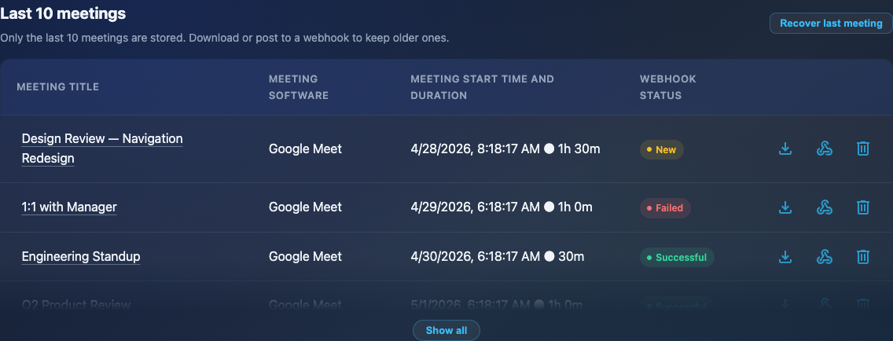
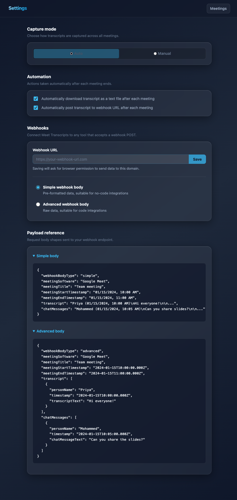

# Meet Transcripts


A Chrome extension that captures Google Meet transcripts locally in your browser and saves them as `.txt` files at the end of each meeting.

Installed as an unpacked extension — not published to the Chrome Web Store. Private, local, no telemetry.

---

## Screenshots

<table>
  <tr>
    <td align="center"><strong>Popup</strong></td>
    <td align="center"><strong>Meeting history</strong></td>
    <td align="center"><strong>Settings</strong></td>
  </tr>
  <tr>
    <td></td>
    <td></td>
    <td></td>
  </tr>
</table>

---

## What it does

Meet Transcripts runs in the background during Google Meet calls. It reads the live captions and assembles a transcript locally in the browser. At the end of each meeting:

- Downloads the transcript as a `.txt` file
- Optionally POSTs it to a configured webhook (Google Docs, Notion, or any HTTP endpoint)

All processing stays in the browser. Nothing leaves the device unless you explicitly configure a webhook.

---

## Installation

This extension is installed in Chrome as an unpacked extension. It requires **developer mode** enabled.

1. Clone or download this repository
2. Install dependencies and build the content script:
   ```sh
   npm install
   npm run build
   ```
3. Open Chrome and go to `chrome://extensions`
4. Enable **Developer mode** (toggle in the top-right corner)
5. Click **Load unpacked**
6. Select the `extension/` folder from this repository
7. The Meet Transcripts icon will appear in your Chrome toolbar

To update: pull the latest `main`, run `npm run build`, then click the refresh icon on the extension card at `chrome://extensions`.

> **Development:** use `npm run dev` to watch `src/` for changes and rebuild automatically.

---

## Usage

The extension has three pages:

- **Popup** — shows live recording status (idle / ready / recording), lets you toggle capture mode, and links to the other pages
- **Meetings** — lists the last 10 captured meetings with download, webhook post, and delete actions per row
- **Settings** — configure capture mode, auto-download, webhook URL, and payload format

**Capture modes:**

- **Auto mode** — records transcripts for every meeting automatically
- **Manual mode** — toggle capture on and off during each meeting via the popup

At the end of a meeting the transcript is downloaded as a `.txt` file. The popup reflects live recording state — pulsing red while recording, pulsing blue when on a call but not yet recording, dimmed when not on Meet.

---

## Webhook integration

Pipe transcripts to any tool that accepts a webhook POST. Configure the URL in the **Settings** page. Supports both a simple pre-formatted body and a raw advanced body for code integrations.

---

## Docs

- [Architecture](docs/architecture.md) — extension internals
- [ADR-001](docs/decisions/ADR-001-fork-and-maintenance-strategy.md) — product history and decisions

---

## Contributing

See [CONTRIBUTING.md](CONTRIBUTING.md).

---

## License

MIT. See [LICENSE](LICENSE).
