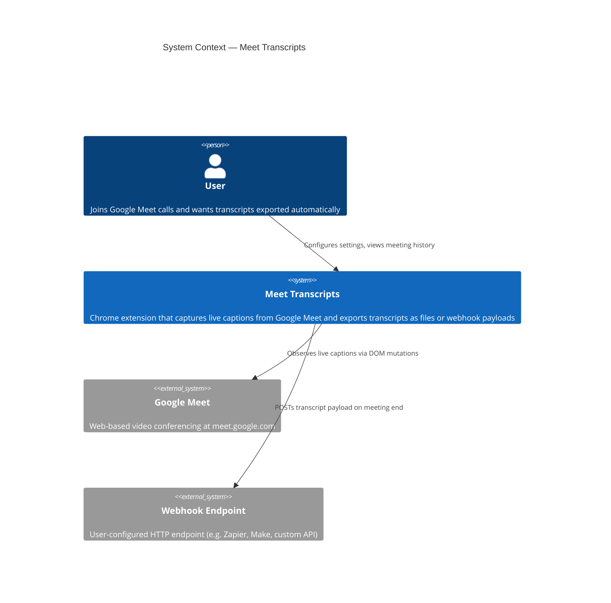
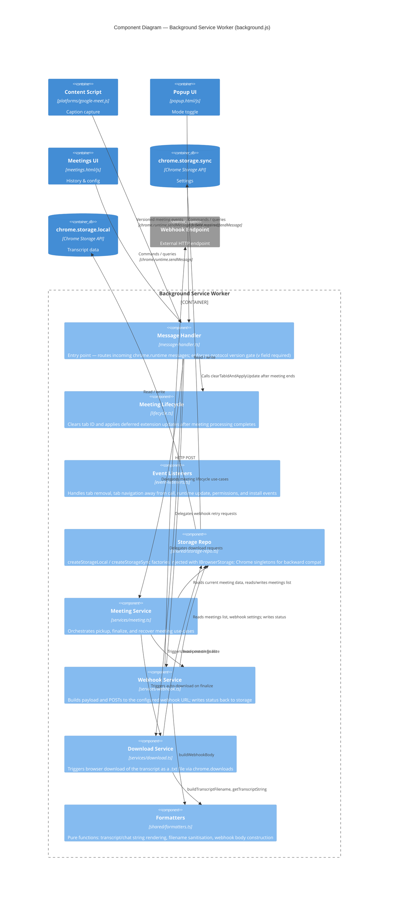
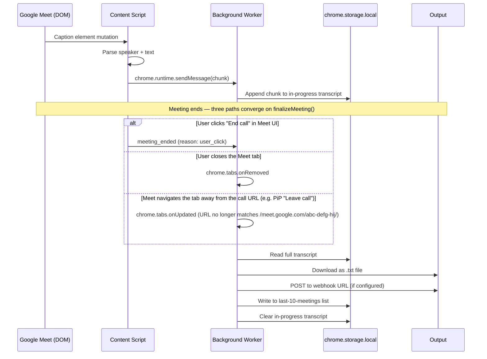
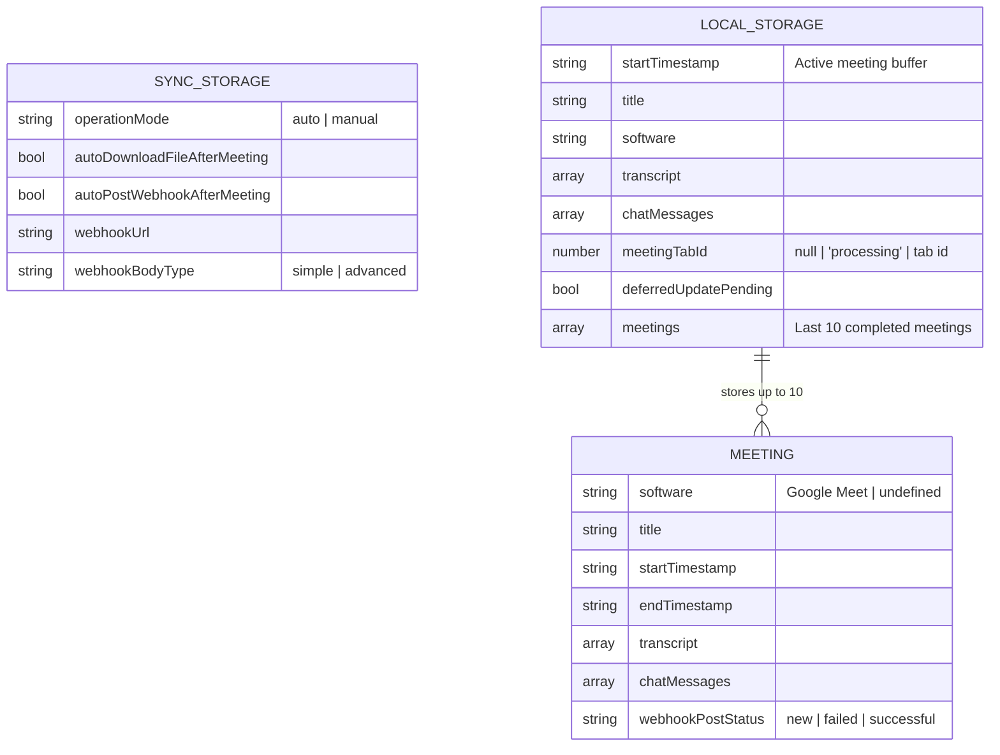

# Architecture

This document describes the architecture of the Meet Transcripts Chrome extension using the [C4 model](https://c4model.com/).

---

## Level 1 — System Context

Who uses the system and what external systems does it interact with.



---

## Level 2 — Container

The internal containers (deployable/runnable units) inside the extension.


---

## Level 3 — Component (Background Service Worker)

Internal components of the central orchestrator.



---

## Source layer structure

The TypeScript source is the canonical representation of the codebase. Vite compiles it to two IIFE bundles placed in `extension/`.

```
src/
├── types.ts                    # Domain types (Meeting, TranscriptBlock, ExtensionResponse, …)
├── browser/                    # Browser API port — interfaces + Chrome concrete implementations
│   ├── types.ts                # IBrowserStorage, IBrowserRuntime interfaces
│   └── chrome.ts               # ChromeStorage, ChromeRuntime — wire interfaces to chrome.*
├── platforms/                  # Platform adapters — all DOM knowledge lives here
│   ├── types.ts                # IPlatformAdapter interface
│   └── google-meet/
│       ├── adapter.ts          # GoogleMeetAdapter — DOM selectors + parsing logic
│       └── index.ts            # Content script entry point → builds to extension/platforms/google-meet.js
├── background/                 # Chrome API I/O adapters — no business logic
│   ├── message-handler.ts      # chrome.runtime.onMessage entry point → builds to extension/background.js
│   ├── lifecycle.ts            # Post-meeting cleanup and deferred update handling
│   ├── event-listeners.ts      # Tab, update, permissions, install event wiring
│   └── content-script.ts       # Content script registration via chrome.scripting
├── content/                    # DOM observers and session lifecycle
│   ├── core/                   # Session lifecycle classes
│   │   ├── meeting-session.ts  # MeetingSession class — drives session start/end
│   │   └── observer-manager.ts # Owns transcript/chat/watchdog MutationObserver lifetimes
│   ├── observer/               # DOM MutationObserver implementations
│   │   ├── transcript-observer.ts
│   │   └── chat-observer.ts
│   ├── state-sync.ts           # Persists content state to chrome.storage.local
│   ├── state.ts                # In-memory state + createSessionState() factory
│   ├── ui.ts                   # Notification banner, status pulse, DOM wait utilities
│   ├── pip-capture.ts          # Document Picture-in-Picture caption capture
│   └── constants.ts            # meetingSoftware, mutationConfig
├── services/                   # Use-case orchestration — owns all Chrome API calls for I/O
│   ├── meeting.ts              # pickupLastMeeting, finalizeMeeting, recoverLastMeeting
│   ├── download.ts             # DownloadService — chrome.downloads + transcript formatting
│   └── webhook.ts              # WebhookService — fetch + notification + status write-back
└── shared/                     # Pure utilities, no side-effects
    ├── errors.ts               # ErrorCode constants + ExtensionError class + ErrorCategory
    ├── formatters.ts           # Text formatting, filename sanitisation, webhook body builder
    ├── logger.ts               # Leveled logger ([meet-transcripts] prefix; debug silenced in prod)
    ├── messages.ts             # sendMessage wrapper + IBrowserRuntime injection
    ├── protocol.ts             # Versioned ExtensionMessage types + msg() factory
    └── storage-repo.ts         # createStorageLocal / createStorageSync + Chrome singletons
```

---

## Data flow — transcript capture to output



---

## Storage model



---

## Key files reference

| File | Role |
|------|------|
| `extension/manifest.json` | Extension metadata, permissions, host matches |
| `extension/background.js` | Compiled service worker — built from `src/background/message-handler.ts` |
| `extension/platforms/google-meet.js` | Compiled content script — built from `src/platforms/google-meet/index.ts` |
| `extension/popup.html/js` | Extension popup UI (plain JS, not compiled) |
| `extension/meetings.html/js` | Meeting history and webhook configuration UI (plain JS, not compiled) |
| `src/types.ts` | Domain types; `ExtensionMessage` re-exported from `protocol.ts` |
| `src/browser/types.ts` | `IBrowserStorage`, `IBrowserRuntime` port interfaces |
| `src/platforms/types.ts` | `IPlatformAdapter` interface |
| `src/platforms/google-meet/adapter.ts` | All Google Meet DOM selectors and mutation parsing |
| `src/content/core/meeting-session.ts` | `MeetingSession` class — session lifecycle |
| `src/shared/errors.ts` | `ErrorCode` constants + `ExtensionError` class + `ErrorCategory` |
| `src/shared/logger.ts` | Leveled logger — `log.debug/info/warn/error`; debug suppressed in production |
| `src/shared/protocol.ts` | Versioned `ExtensionMessage` types + `msg()` factory |
| `src/shared/storage-repo.ts` | `createStorageLocal` / `createStorageSync` + Chrome singletons |
| `src/shared/formatters.ts` | Pure text formatting, filename sanitisation, webhook body builder |
| `src/services/meeting.ts` | Meeting use-case orchestration |
| `vite.config.js` | Vite build — two IIFE bundles (background + content script) |
| `docs/decisions/` | Architecture decision records |
