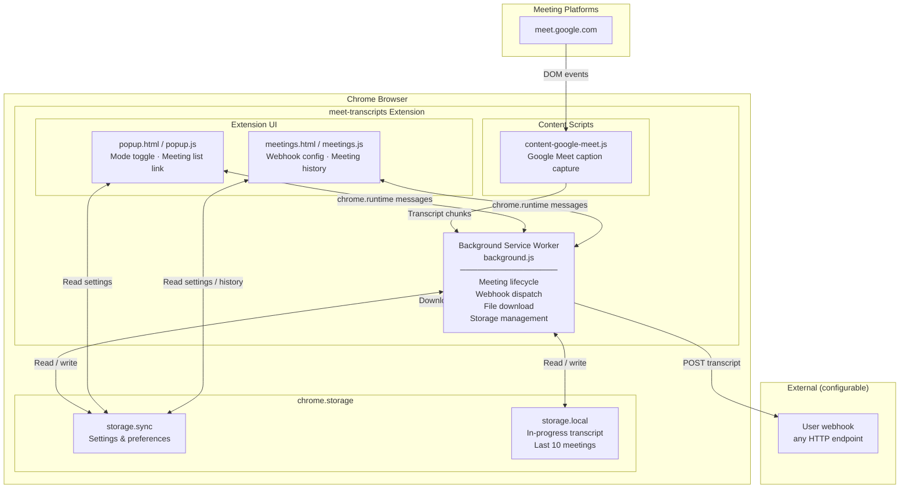
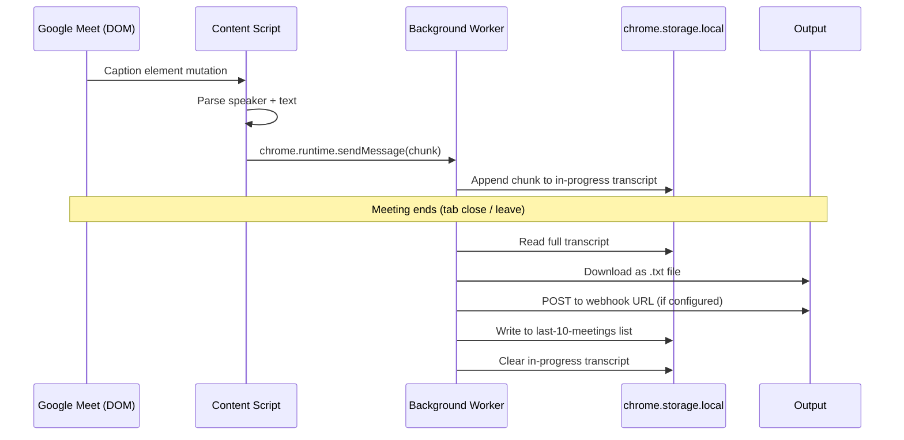
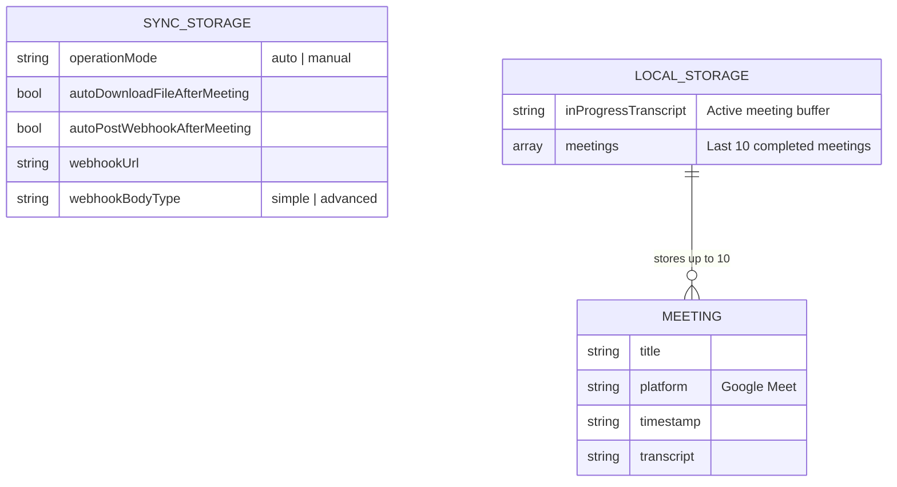

# Architecture

This document describes the architecture of the meet-transcripts Chrome extension.

---

## Extension architecture

meet-transcripts is a **Manifest v3 Chrome extension** composed of three layers:
a background service worker, a content script for Google Meet, and a UI layer
(popup + meetings page).

---

## Data flow: transcript capture to output

---

## Transcript storage model

---

## Key files reference

| File | Role |
|------|------|
| `extension/manifest.json` | Extension metadata, permissions, host matches |
| `extension/background.js` | Service worker — central orchestrator |
| `extension/content-google-meet.js` | Google Meet DOM observer and transcript capture |
| `extension/popup.html/js` | Extension popup UI |
| `extension/meetings.html/js` | Meeting history and webhook configuration UI |
| `types/index.js` | JSDoc type definitions |
| `docs/decisions/` | Architecture decision records |
