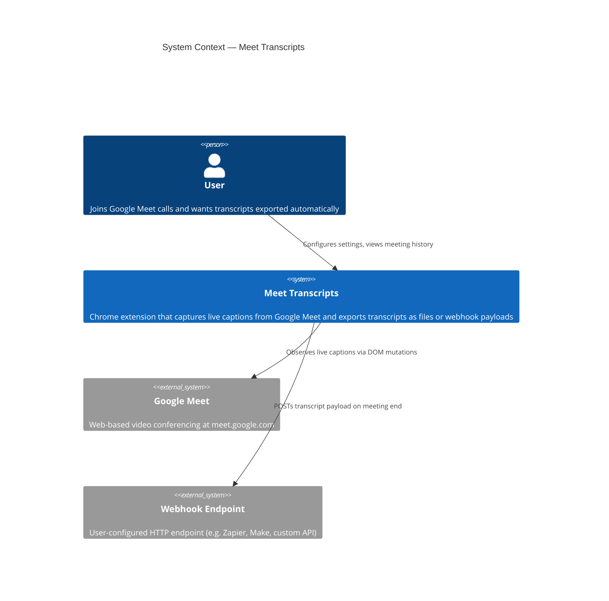
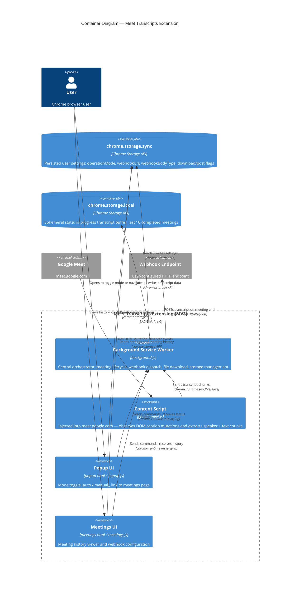
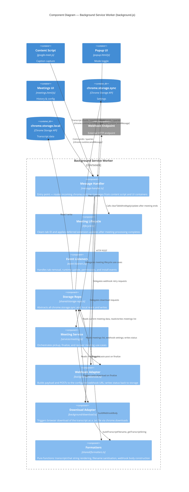
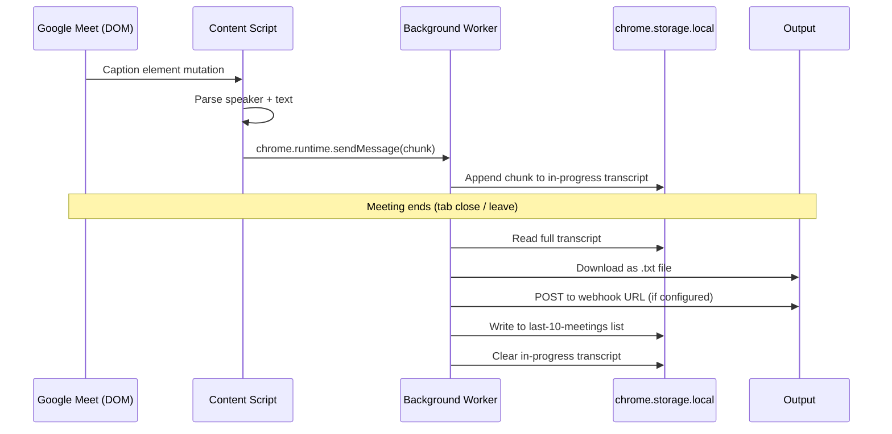
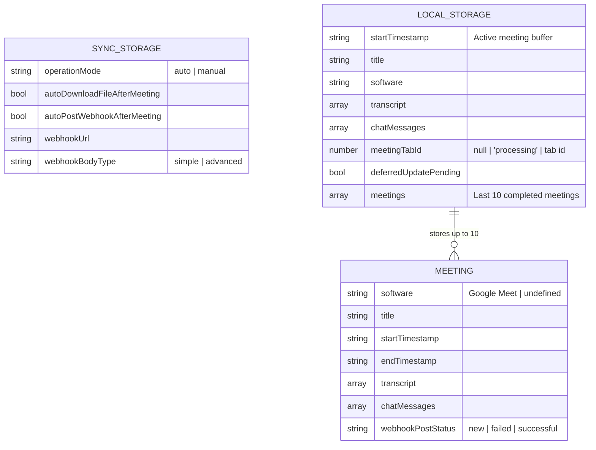

# Architecture

This document describes the architecture of the Meet Transcripts Chrome extension using the [C4 model](https://c4model.com/).

---

## Level 1 — System Context

Who uses the system and what external systems does it interact with.



---

## Level 2 — Container

The internal containers (deployable/runnable units) inside the extension.



---

## Level 3 — Component (Background Service Worker)

Internal components of the central orchestrator.



---

## Source layer structure

The TypeScript source is the canonical representation of the codebase. Vite compiles it to two IIFE bundles placed in `extension/`.

```
src/
├── types.ts                    # Domain types (Meeting, TranscriptBlock, ExtensionResponse, …)
├── background/                 # Chrome API I/O adapters — no business logic
│   ├── message-handler.ts      # chrome.runtime.onMessage entry point → builds to extension/background.js
│   ├── lifecycle.ts            # Post-meeting cleanup and deferred update handling
│   ├── event-listeners.ts      # Tab, update, permissions, install event wiring
│   ├── content-script.ts       # Content script registration via chrome.scripting
│   ├── download.ts             # chrome.downloads adapter
│   └── webhook.ts              # fetch adapter + notification
├── content/                    # DOM observers — builds to extension/google-meet.js
│   ├── google-meet.ts          # Content script entry point
│   ├── meeting-session.ts      # Extension status check + meeting routines
│   ├── state-sync.ts           # Persists content state to chrome.storage.local
│   ├── state.ts                # In-memory content script state
│   ├── ui.ts                   # Notification banner, status pulse
│   ├── constants.ts            # meetingSoftware constant
│   └── observer/               # DOM MutationObserver implementations
│       ├── transcript-observer.ts
│       └── chat-observer.ts
├── services/                   # Use-case orchestration — no Chrome APIs
│   ├── meeting.ts              # pickupLastMeeting, finalizeMeeting, recoverLastMeeting
│   ├── download.ts             # DownloadService façade
│   └── webhook.ts              # WebhookService façade
└── shared/                     # Pure utilities, no side-effects
    ├── errors.ts               # ErrorCode constants
    ├── formatters.ts           # Text formatting, filename sanitisation, webhook body builder
    ├── messages.ts             # sendMessage wrapper, recoverLastMeeting helper
    └── storage-repo.ts         # StorageLocal / StorageSync typed abstractions
```

---

## Data flow — transcript capture to output



---

## Storage model



---

## Key files reference

| File | Role |
|------|------|
| `extension/manifest.json` | Extension metadata, permissions, host matches |
| `extension/background.js` | Compiled service worker — built from `src/background/message-handler.ts` |
| `extension/google-meet.js` | Compiled content script — built from `src/content/google-meet.ts` |
| `extension/popup.html/js` | Extension popup UI (plain JS, not compiled) |
| `extension/meetings.html/js` | Meeting history and webhook configuration UI (plain JS, not compiled) |
| `src/types.ts` | All domain types and message/response contracts |
| `src/shared/errors.ts` | `ErrorCode` constants |
| `src/shared/storage-repo.ts` | `StorageLocal` / `StorageSync` typed wrappers |
| `src/shared/formatters.ts` | Pure text formatting, filename sanitisation, webhook body builder |
| `src/services/meeting.ts` | Meeting use-case orchestration |
| `vite.config.js` | Vite build — two IIFE bundles (background + content script) |
| `docs/decisions/` | Architecture decision records |
